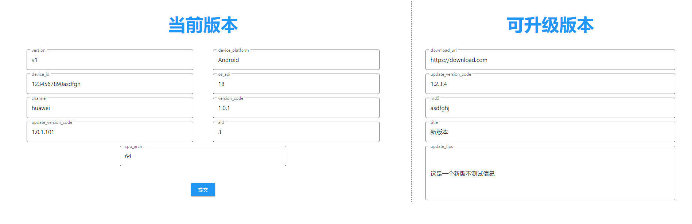

# version-update
字节跳动 版本升级 项目

[营员手册](https://bytedance.feishu.cn/docs/doccn2tYZFh28wRCvBmDqREoNie)

## home_page_server
首页服务器。
运行在 127.0.0.1:8080
请求该服务器时返回一个页面。可在该页面输入当前版本信息并提交到*版本更新接口服务器*，然后可查看服务器返回的可更新版本的信息。

## version_update_server
版本更新接口服务器。
运行在 127.0.0.1:8081
使用Get方式请求该服务器，Get参数见*营员手册*，返回可升级的版本信息，返回值见*营员手册*。

## 连通测试
1. 启动版本更新接口服务器： `./version_update_server/main.exe`
2. 启动首页服务器： `./home_page_server/main.exe`
3. 浏览器访问： `http://127.0.0.1:8080`
4. 填写左侧*当前版本*当前版本信息，点击提交
5. 可在右侧*可升级版本*查看可升级版本信息
