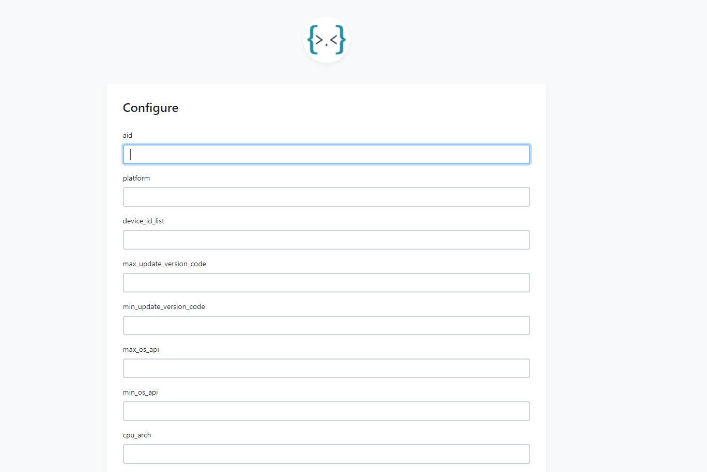

# version-update
字节跳动 版本升级 项目

[营员手册](https://bytedance.feishu.cn/docs/doccn2tYZFh28wRCvBmDqREoNie)

# 启动
运行 `./version-update.exe`
浏览器打开 127.0.0.1:8080
+ 获取新版本页面： 127.0.0.1:8080
+ 配置新规则页面： 127.0.0.1:8080/config

## 获取可升级版本
1. 浏览器访问： `http://127.0.0.1:8080`
2. 填写左侧*当前版本*当前版本信息，点击提交
3. 可在右侧*可升级版本*查看可升级版本信息

## 添加规则
1. 浏览器访问： `http://127.0.0.1:8080/config`
2. 填写*新规则*信息，点击提交
3. 查看添加结果

